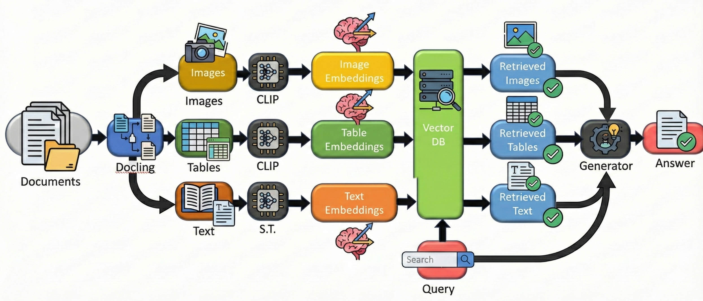
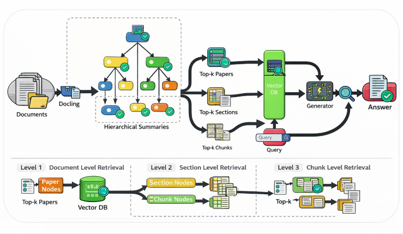
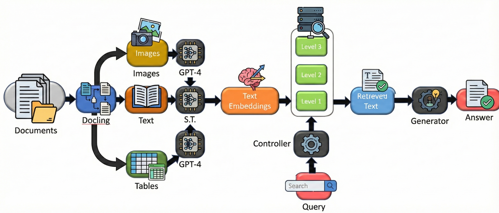

# ScaleRAG: Multimodal Hierarchical RAG for Scientific Papers

## Team Information
- **Team Name**: ScaleRAG
- **Members**:
  - Mahdi Saleh Tabesh (mt3846, Columbia University)
  - Manush Kalwari (mmk2266, Columbia University)

---

## 1. Problem Statement

Retrieval-Augmented Generation (RAG) systems struggle to scale to large scientific corpora while preserving document structure and multimodal evidence such as figures and tables. Flat chunking breaks global context, text-only retrieval misses critical visual evidence, and large-scale corpora introduce severe recall–latency trade-offs.

This project investigates **scalable, compute-efficient RAG pipelines** that maintain retrieval quality, grounding, and predictable latency when applied to long, structured scientific papers.

---

## 2. Model Description

We study and compare **three RAG approaches**, progressing from flat multimodal retrieval to fully hierarchical, adaptive pipelines.

---

### Approach I: Multimodal RAG Pipeline



**Key Characteristics**
- Modality-aware document parsing using **Docling**
- Text embeddings + CLIP vision embeddings for figures and tables
- Flat retrieval across modalities (top-k text + top-k visuals)
- Separate FAISS indices per modality
- Multimodal answer generation using **LLaVA-1.5-7B (4-bit)**

**Intuition**  
Retrieve complementary evidence from text and visuals, enabling answers that require figures or tables that text-only RAG would miss.

---

### Approach II: Hierarchical RAPTOR-style RAG (ScaleRAG)



**Key Characteristics**
- Hierarchical document representation:
  - L0: raw chunks
  - L1: section summaries
  - L2: paper-level summaries
- Offline recursive summarization using lightweight LLMs
- Multi-level FAISS indexing
- Coarse-to-fine retrieval (paper → section → chunk)
- Efficient scaling to 1K+ papers

**Intuition**  
First retrieve globally relevant papers and sections using summaries, then drill down to fine-grained chunks only when needed.

---

### Approach III: Hierarchical Uni-Modal RAG with Adaptive Depth



**Key Characteristics**
- Document parsing into text, figures, and tables using **Docling**
- Non-textual elements (figures, tables) converted into **textual summaries offline**
- Hierarchical representation with three granularities:
  - L1: Document-level embeddings
  - L2: Page-level embeddings
  - L3: Chunk-level embeddings
- Multi-level FAISS indices built offline
- **Adaptive controller** selects retrieval depth based on query complexity
- Selective traversal of indices avoids expensive global scans

**Intuition**  
Hierarchical Uni-Modal RAG trades a single expensive global search for multiple cheap, targeted searches.  
Most queries are resolved at coarse levels (document or page), while fine-grained chunk retrieval is used only when necessary—improving scalability and latency efficiency.


---

## 3. Results Summary

| Metric                         | Value |
|--------------------------------|-------|
| Recall@5 (1023 papers)         | ~75%  |
| nDCG@5                         | ~0.60 |
| Grounding Accuracy             | 80–83% |
| Avg. Retrieval Latency         | ~150 ms |
| Latency Scaling                | Stable |
| Device                         | Single GPU (T4) |

---

## 4. Reproducibility Instructions

### Installation
```bash
pip install -r requirements.txt
```

### Data Preparation
```bash
jupyter notebook RAG_Data_Preparation.ipynb
```

### Run Pipelines
```bash
jupyter notebook rag_v1/
jupyter notebook rag_v2/
```

This project is **inference-only**; no fine-tuning is performed.

---

### WandB Dashboard

- Evaluation and profiling were performed locally.
---

### Running the Backend

#### Minimal run (no observability)
Runs the RAG API without metrics, traces, or logs collection.

```bash
cd 01-backend
uvicorn app:app --host 0.0.0.0 --port 8000
```

---


### Observability

Backend is instrumented using OpenTelemetry, visualized in Grafana (LGTP stack).

Tracked signals include:
- p50 / p95 / p99 latency (end-to-end and stage-level)
- Retrieval & Generation stage latency
- Trace-correlated structured logs
- Per-request execution traces

---

From the repository root:
```bash
docker compose up
```

Grafana UI:
```
http://localhost:3000
```

Login:
```
admin / admin
```

---

### Verifying the Setup

- **Prometheus**: http://localhost:9090  
  Search for `rag_latency_ms`

- **Grafana**: http://localhost:3000  
  Use Explore-> Prometheus / Tempo / Loki

- **Tempo**: traces visible via Grafana Explore  
- **Loki**: logs visible via Grafana Explore

---

## 5. Repository Structure

```
ScaleRAG-Multimodal-Hierarchical/
├── figures/
├── rag_v1/
├── rag_v2/
├── utils/
├── data/
├── RAG_Data_Preparation.ipynb
├── Project_Report.pdf
├── Project_Presentation.pdf
└── README.md
```

---

## Citation

```bibtex
@project{ScaleRAG2025,
  title       = {ScaleRAG: Multimodal Hierarchical RAG for Scientific Papers},
  author      = {Mahdi Saleh Tabesh and Manush Kalwari},
  year        = {2025},
  institution = {Columbia University}
}
```
